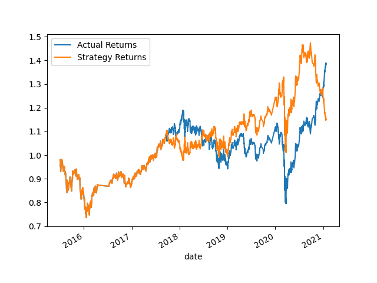

# Algorithmic Machine Learning Trading Bot

In this Challenge, you’ll assume the role of a financial advisor at one of the top five financial advisory firms in the world. Your firm constantly competes with the other major firms to manage and automatically trade assets in a highly dynamic environment. In recent years, your firm has heavily profited by using computer algorithms that can buy and sell faster than human traders.

The speed of these transactions gave your firm a competitive advantage early on. But, people still need to specifically program these systems, which limits their ability to adapt to new data. You’re thus planning to improve the existing algorithmic trading systems and maintain the firm’s competitive advantage in the market. To do so, you’ll enhance the existing trading signals with machine learning algorithms that can adapt to new data.

What You're Creating
You’ll combine your new algorithmic trading skills with your existing skills in financial Python programming and machine learning to create an algorithmic trading bot that learns and adapts to new data and evolving markets.

In a Jupyter notebook, you’ll do the following:

- Implement an algorithmic trading strategy that uses machine learning to automate the trade decisions.

- Adjust the input parameters to optimize the trading algorithm.

- Train a new machine learning model and compare its performance to that of a baseline model.

As part of your GitHub repository’s README.md file, you will also create a report that compares the performance of the machine learning models based on the trading predictions that each makes and the resulting cumulative strategy returns.

## Technologies

Programming Languages: Python 3.7.13

Interactive Development Environment: JupyterLab 

Libraries: 
- Pandas - A Python library that is used for data manipulation, analysis, and visualization. 
- Numpy - A popular open-source numerical computing library for Python which provides a powerful array object and a collection of mathematical functions. 
- HvPlot - A Python library that provides a high-level interface for quickly creating interactive plots and visualizations using popular plotting libraries such as Matplotlib, Bokeh, and Plotly.
- Sklearn - also known as Scikit-learn, which is a popular machine learning library in Python that provides a wide range of tools and algorithms for machine learning tasks such as classification, regression, clustering, and dimensionality reduction.

Operating System(s):  Any operating system that supports Python, including Windows & macOS.

## Installation Guide

To run this analysis, make sure you install the necessary dependencies:

1. Install Python: https://www.python.org/downloads/
2. Install and run Jupyter Lab:  https://jupyter.org/install
3. Clone the repository: `git clone "https://github.com/mikenguyenx/14_ml_algorithmic_trading"` using git or download the ZIP file and extract it to a local directory.

## Usage

To run the script:

1. Open a terminal or command prompt and navigate to the directory with the analysis.
2. Open `machine_learning_trading_bot.ipynb` in Jupyter Lab.
3. Run the code cells by clicking on the run button or by pressing the `Shift + Enter` key combination to load and preprocess the data, and generate visualizations

## Instructions

1. Establish a Baseline Performance
2. Tune the Baseline Trading Algorithm
3. Evaluate New Machine Learning Classifier
4. Evaluation Report

## Trading Algorithm Plots

### Baseline Trading Algorithm Plot

### Tuned Trading Algorithm Plot

## Contributors

Mike Nguyen

## License

MIT